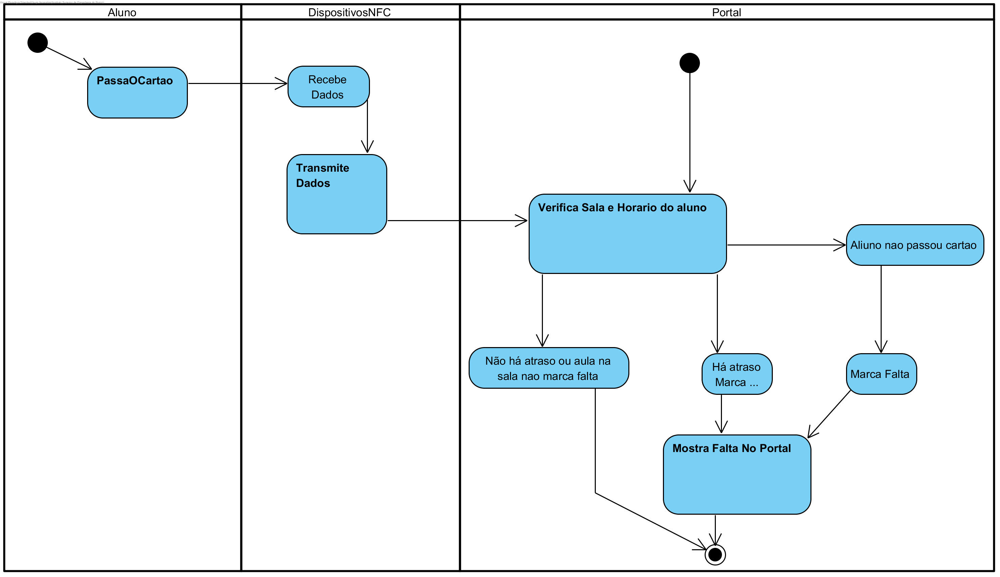

# Sistemas de Informação no mercado global

## Portal

### Processos de negócio e os respetivos participantes
  - Gerar certidões ou diplomas
    - Aluno, Sistema e Funcionário da Divisão Académica
  - Autorizar estacionamento no parque
    - Aluno e Sistema
  - Inscrever em exames
    - Aluno e Sistema
  - Realizar matrículas
    - Aluno, Sistema e Diretores de Departamento
  - Fazer pedidos Helpdesk
    - Aluno, Sistema e Funcionário responsável pelas plataformas
  - Usufruir dos Serviços de Apoio Técnico (SAT)
    - Aluno, Sistema e Funcionários responsáveis pelo gabinete

### Página com informação de síntese
A página de registo das faltas é um exemplo de página de síntese. O processo da marcação das faltas ocorre através da recolha de dados do cartão do aluno e envia os dados para o portal. No portal verifica se o aluno contém uma aula naquela sala, marca presença e não faz aparecer os dados no portal, caso haja atraso ou falta, ou seja, o aluno não passou o cartão na aula, faz aparecer a informação correspondente no portal. O valor para o aluno é ter a informação atualizada sobre a sua frequência nas aulas e controlar a mesma frequência. Assim como o valor para os professores será a aquisição de uma perceção do interesse dos alunos da frequência nas aulas.

### Diagrama de atividades UML com swim lanes

### Vantagens e desvantagens do desenvolvimento de um sistema de informação à medida
   - Vantagens:
     - A construção do sistema corresponde diretamente aos requisitos da organização/dos utilizadores.
     - Os custos extra associados ao seu desenvolvimento podem ser diluídos nos benefícios que proporcionarão ao longo dos anos de utilização.

   - Desvantagens:
     - Implica um grande investimento nomeadamente no que se refere aos recursos internos qualificados, ou seja, no que toca aos requisitos, de certa forma, personalizados, leva a que hajam profissionais especializados e que estejam preparados para todo o tipo de requisitos pedidos pela empresa.
     - Perceber o que o cliente realmente quer, requer maior tempo de compreensão, logo gera um maior tempo de levantamento de requisitos. Se a compreensão não for bem feita, gera que o tempo de desenvolvimento seja maior.